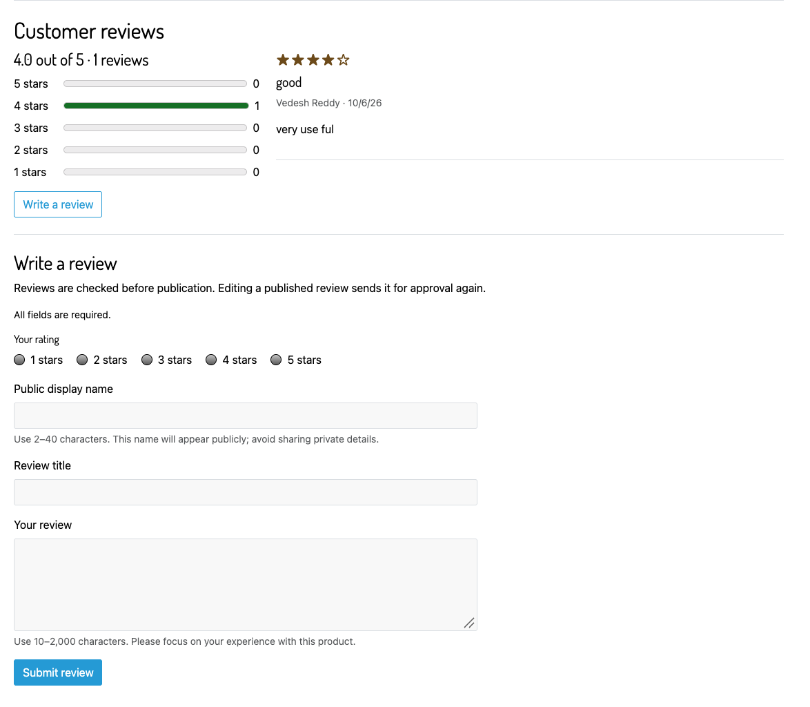
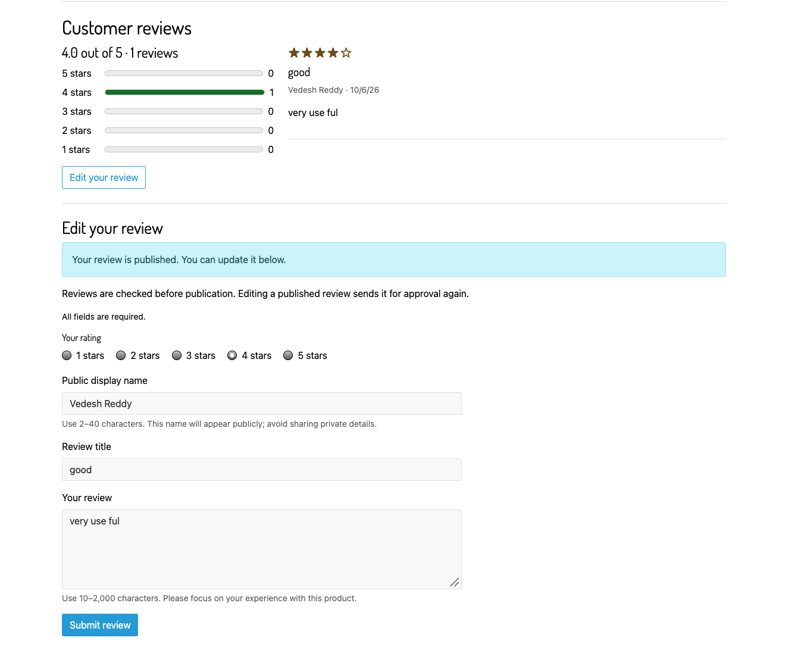
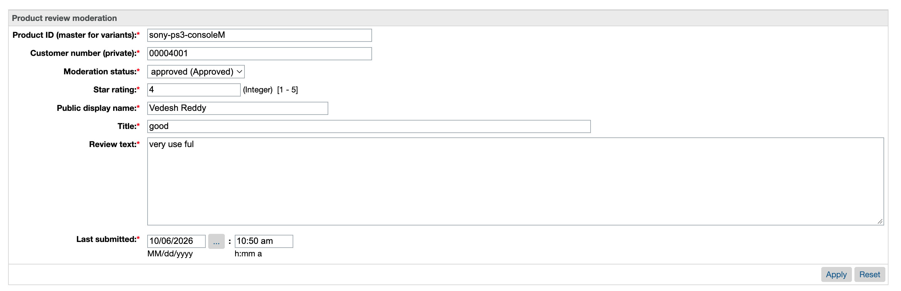

<div align="center">

# SFCC Reviews Cartridge

### Customer feedback, from the product page to merchant approval.

A focused SFRA extension for product ratings, written reviews, and Business Manager moderation.

[](https://github.com/Vedesh-reddy/sfcc-reviews-cartridge/actions/workflows/ci.yml)


[Get started](docs/INSTALLATION.md) · [Merchant guide](docs/MERCHANT-GUIDE.md) · [Code reference](docs/CODE-REFERENCE.md) · [Architecture](docs/ARCHITECTURE.md) · [Phase PRs](docs/DEVELOPMENT-PHASES.md)

</div>


> Working sandbox screenshots supplied by the author. The implementation was verified in a customized SFRA 8 storefront using Bootstrap 5.

## What it does

| For shoppers | For merchants | For developers |
| --- | --- | --- |
| Read reviews and rating breakdowns | Approve, reject, or hold submissions | A separate `plugin_productreviews` overlay |
| Submit a 1–5 star rating and written review | Enable or disable reviews per site | Site-scoped custom objects |
| Edit their own review after signing in | Choose approval or immediate publication | Explicit CSRF and identity checks |
| Browse five reviews per page | Manage reviews in Business Manager | Build scripts, CI, tests, and code documentation |

Variants and variation groups share their master product's reviews. Each customer has one review per product per site. Editing a published review sends it for approval again when moderation is enabled.

## Start in five steps

```sh
git clone https://github.com/Vedesh-reddy/sfcc-reviews-cartridge.git
cd sfcc-reviews-cartridge
npm ci
npm run validate
npm run package:metadata
```

1. **Build:** `npm run validate` runs the checks, 28 unit tests, and asset build.
2. **Import:** import `dist/product-reviews-metadata.zip` through **Administration → Site Development → Site Import & Export**.
3. **Deploy:** upload `cartridges/plugin_productreviews` including its generated `cartridge/static` assets into your active code version.
4. **Activate:** place `plugin_productreviews` before `app_storefront_base` in the site's cartridge path.
5. **Configure:** open **Merchant Tools → Site Preferences → Custom Site Preference Groups → Product Reviews** and enable reviews.

```text
plugin_productreviews:app_storefront_base:modules
```

Preserve your site's other cartridges. SFRA supplies the shared `server` module, layout, asset helper, login routes, and global jQuery; this repository does not bundle the base storefront. Follow the [installation guide](docs/INSTALLATION.md) for deployment commands, import details, and compatibility notes.

## See the complete experience

### Write a review

Signed-in shoppers choose their rating and provide a public display name, title, and review text.



<details>
<summary><strong>More storefront screenshots: editing and the empty state</strong></summary>

**Edit a published review**



**A product with no reviews yet**


</details>

### Configure and moderate

**Merchant Tools → Site Preferences → Custom Site Preference Groups → Product Reviews**


**Merchant Tools → Custom Objects → Manage Custom Objects**

Select `ProductReview`, open a review, set its moderation status, and apply the change.



| Status | What shoppers see |
| --- | --- |
| `pending` | Only the author sees their saved review in the edit form. |
| `approved` | The review is public and contributes to ratings. |
| `rejected` | The review is hidden; its author can revise and resubmit. |

## How it fits together

```text
Product detail page
  └─ Review widget → Reviews-List → approved reviews + customer-specific form
                         │
Signed-in submission → Reviews-Submit → validation → ProductReview custom object
                                                       │
Business Manager → Manage Custom Objects → approval ────┘
```

The product page can stay cached. Review fragments and forms expire immediately through SFCC's response API, so customer-specific form values and CSRF tokens stay outside shared page caches. [Read the architecture](docs/ARCHITECTURE.md).

## Repository guide

| Path | Purpose |
| --- | --- |
| [`cartridges/plugin_productreviews`](cartridges/plugin_productreviews) | Deployable cartridge: controllers, service, templates, client code, resources |
| [`metadata/product-reviews/meta`](metadata/product-reviews/meta) | Review custom object and site-preference definitions |
| [`test/unit/plugin_productreviews`](test/unit/plugin_productreviews) | 28 storage and controller tests using platform mocks |
| [`scripts`](scripts) | Builds, template checks, documentation checks, metadata packaging |
| [`docs`](docs) | Installation, operation, architecture, code reference, testing, troubleshooting |
| [`.github/workflows/ci.yml`](.github/workflows/ci.yml) | Validation and artifact packaging on Node 22 and 24 |

## Development commands

| Command | Result |
| --- | --- |
| `npm test` | Run all 28 cartridge unit tests |
| `npm run build` | Compile review JavaScript and SCSS into `cartridge/static/default` |
| `npm run lint` | Check JavaScript, SCSS, ISML, and local documentation links |
| `npm run validate` | Run lint, tests, and build |
| `npm run package:metadata` | Produce the Business Manager import ZIP in `dist` |

The project is presented through five focused feature branches and PRs, merged in order. See [development phases](docs/DEVELOPMENT-PHASES.md) for scope and links.

## Scope and attribution

The cartridge covers storefront reviews and Business Manager moderation. It does not implement verified-purchase badges, review images, helpful votes, automatic account-erasure integration, listing-tile ratings, or structured-data ratings. Public totals use database queries, with five rating counts plus a paged list; evaluate an aggregate strategy for high-traffic sites.

This is an independent extension, not an official Salesforce product. SFRA-derived template notices and terms are retained in [NOTICE.md](NOTICE.md). The npm package is marked private to prevent accidental npm publication; that does not control this GitHub repository's visibility.
