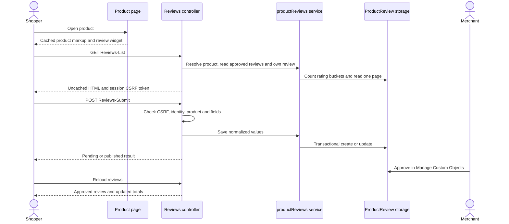

# Architecture and data model

[← README](../README.md) · [Code reference](CODE-REFERENCE.md)

## Request flow

## Data model

The [metadata definition](../metadata/product-reviews/meta/custom-objecttype-definitions.xml) declares `ProductReview` with **site** scope and **no-staging** behavior.

| Attribute | Type | Role |
| --- | --- | --- |
| `reviewID` | String key | SHA-256 hex digest of JSON `[siteID, canonicalProductID, customerNo]` |
| `productID` | String | Canonical product; a master ID for variants and variation groups |
| `customerNo` | String | Private owner identifier taken from the authenticated session |
| `displayName` | String | Shopper-selected public name |
| `rating` | Integer | A whole-star value from 1 to 5 |
| `title` | String | Public review heading |
| `body` | Text | Plain review text, escaped when rendered |
| `status` | Enum of string | `pending`, `approved`, or `rejected` |
| `submittedAt` | Datetime | Last submission; used for ordering and the one-minute update guard |

The key is stable and fixed-length. JSON encoding avoids delimiter collisions between inputs. The unique custom-object key prevents separate rows for the same owner and canonical product. Writes occur in `Transaction.wrap`; a failed concurrent write is returned as a controlled failure and can be retried.

Public projection includes only `displayName`, `title`, `body`, `rating`, and `submittedAt`. The own-review lookup separately supplies the signed-in author's form values and status.

## Product identity

`getProduct` rejects missing, malformed, or offline product requests. An online variant or variation group resolves to its online master. Simple products, bundles, and product sets use their own IDs. No verified-purchase check is performed.

## Moderation lifecycle

| Action | Approval enabled | Approval disabled |
| --- | --- | --- |
| First submission | `pending` | `approved` |
| Edit any existing review | `pending` | `approved` |
| Merchant approval | `approved` | `approved` |
| Merchant rejection | `rejected` | `rejected` |

Only `approved` contributes to public reads and aggregates. Updating an approved review replaces its stored text and changes its status; the earlier approved text is not retained as a separate revision.

## Queries and pagination

`getReviews` performs five count queries, one per approved star bucket, plus a query for the approved page. Filters use positional parameters, not string concatenation. Count iterators close in `finally`; when the platform cannot supply a count, the fallback counts the iterator without materializing the records.

The page size is five. Invalid or negative page input falls back to the first page; values beyond the last page are clamped. The list is ordered by `submittedAt desc, creationDate desc` and seeks directly to the page offset. Exact timestamp ties do not have a third tiebreaker. Every list iterator is closed after reading or on failure.

The average is calculated from approved buckets and represented to one decimal place. There is no aggregate cache, so Business Manager changes become visible on the next request. High-traffic installations should measure the cost of these queries before adopting an aggregate cache with an explicit moderation invalidation strategy.

## Cache and session boundaries

The outer product page can use SFRA page caching. Its widget contains the product ID and fragment URL, not customer-specific form values. `Reviews-List` and `Reviews-Show` set `res.cachePeriod = 0` and expire the underlying response at the epoch using `res.base.setExpires(new Date(0))`.

SFCC generates `Cache-Control`; directly setting that header or `Pragma` through the platform header API throws. Successful live checks confirmed `no-cache, no-store, must-revalidate` on the review responses.

Two session privacy keys support navigation:

| Key | Value | Lifetime |
| --- | --- | --- |
| `productReviewsReturnPID` | Canonical product ID string | Saved before login and consumed by `Reviews-Return` |
| `productReviewSaved` | JSON string containing product ID and result status | Used by a successful non-AJAX POST and consumed by the matching full page |

Session values are primitives; the flash object is serialized explicitly. Redirects are generated from known routes and validated product IDs, rather than an arbitrary submitted return URL.

## Trust boundaries

The browser submits rating, name, title, text, product ID, and a CSRF token. It cannot choose the saved customer number, moderation status, or canonical product ID. The controller validates CSRF and authenticated identity before saving. All failures return before a write.

Templates HTML-encode review text. Browser messages and field errors use jQuery `.text()`. The fragment inserted with `.html()` is generated by the server's escaped ISML templates. Updating a rating clears its stale group-level error; the server still validates the next submission.

Rate limiting is a per-review one-minute guard using `submittedAt`; it is not a global customer or IP rate limit. Customer verification, bot mitigation, media reviews, and moderation notifications would be separate extensions.
