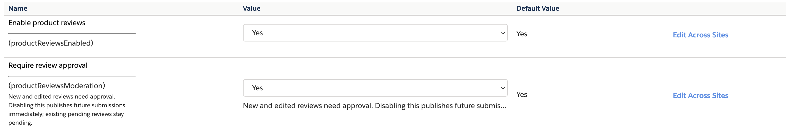

# Installation

[← README](../README.md) · [Merchant guide](MERCHANT-GUIDE.md) · [Troubleshooting](TROUBLESHOOTING.md)

## Requirements

- An SFCC sandbox with an existing SFRA storefront and permission to upload code, import metadata, and edit the site's cartridge path.
- Node.js 22 or newer and npm for local tooling. Node runs build tools and tests; SFCC executes the cartridge's server JavaScript.
- The tested integration is SFRA 8 with Bootstrap 5 styling. Stock SFRA or another theme may use different Bootstrap utilities; review the seven template overlays before adopting them.
- The base `app_storefront_base` and `modules` cartridges must remain available. The plugin depends on the SFRA `server` module, asset helper, layouts, resource/URL helpers, login flow, and jQuery.

## 1. Install and build

```sh
git clone https://github.com/Vedesh-reddy/sfcc-reviews-cartridge.git
cd sfcc-reviews-cartridge
npm ci
npm run validate
npm run package:metadata
```

The JavaScript bundle is `cartridges/plugin_productreviews/cartridge/static/default/js/productReviews.js`.
The stylesheet is `cartridges/plugin_productreviews/cartridge/static/default/css/productReviews.css`.
Build output and `node_modules` are ignored by Git. Deploy the built assets with the cartridge.

## 2. Import definitions

Open **Administration → Site Development → Site Import & Export** and import `dist/product-reviews-metadata.zip`.

The archive contains exactly:

```text
product-reviews/
└── meta/
    ├── custom-objecttype-definitions.xml
    └── system-objecttype-extensions.xml
```

This imports the site-scoped `ProductReview` custom object type and the `ProductReviews` site-preference group. The archive contains definitions, not customer review records or site-specific settings. Review objects use `no-staging` storage behavior.

If a type or attribute with the same ID already exists, reconcile its definition before importing. The key, scope, and attributes must match [the data model](ARCHITECTURE.md#data-model).

## 3. Deploy the cartridge

Use your existing SFCC code-upload workflow. For the Salesforce B2C CLI, after configuring your local sandbox credentials, the equivalent command is:

```sh
npx @salesforce/b2c-cli code deploy ./cartridges -c plugin_productreviews
```

The CLI can read a local `dw.json`; create it from `dw.example.json` and fill in your own values. `dw.json` is ignored by Git. Do not copy a real deployment configuration into documentation, screenshots, commits, or PR bodies.

The required server layout is:

```text
<code-version>/
└── plugin_productreviews/
    └── cartridge/
        ├── controllers/Reviews.js
        ├── scripts/productReviews.js
        ├── templates/
        ├── static/default/js/productReviews.js
        ├── static/default/css/productReviews.css
        └── plugin_productreviews.properties
```

A nested `plugin_productreviews/cartridges/plugin_productreviews` upload will not register the correct controller. Activate the intended code version when necessary.

## 4. Configure the cartridge path

Open **Administration → Sites → Manage Sites → your site → Settings**.
Insert the plugin before `app_storefront_base` while preserving the rest of the site's path:

```text
plugin_productreviews:app_storefront_base:modules
```

If a custom cartridge ahead of the plugin overrides `pidRating`, `descriptionAndDetails`, or `setDetails`, reconcile those overrides or add the `reviews/widget` include there. For custom Page Designer components, include the widget with the appropriate page `product` model.

Login redirect slot **3** is assigned to `Reviews-Return`. Resolve any conflict with another plugin that already uses this slot in `oAuthRenentryRedirectEndpoints.js`.

## 5. Enable the feature

Open **Merchant Tools → Site Preferences → Custom Site Preference Groups → Product Reviews**.
Set **Enable product reviews** to **Yes** and **Require review approval** to **Yes** for the default moderated workflow.



Clear the site's page cache after the first installation or after changing the enabled preference. Review fragments are uncached, but the outer product-page markup may still be cached. Hard-refresh the browser after updating compiled assets.

## 6. Verify the full flow

1. Open a product as a guest and scroll below its description. Confirm the review panel and sign-in link appear.
2. Sign in from the panel and submit a rating and review. Confirm the pending message.
3. In **Merchant Tools → Custom Objects → Manage Custom Objects**, select `ProductReview` and approve it.
4. Reload the product. Confirm the public review, average, and star breakdown.
5. Edit it after one minute. With moderation enabled, confirm it returns to pending.

The [testing guide](TESTING.md) includes rejection, pagination, variant grouping, disabled features, and error cases.

## Add it to an existing RefArch workspace

Copy the `plugin_productreviews` folder into that workspace's `cartridges/` directory and copy the metadata folder alongside your existing import definitions. Either build this repository separately before copying its generated static assets, or integrate its entry points into the parent project's build.

The original RefArch integration used `sgmf-scripts --cartridgeName plugin_productreviews` and selected that cartridge's output path in webpack. That parent build configuration is not required for this standalone repository's `npm run build`.

The cartridge README links to these instructions; no second npm project or credential file belongs inside the cartridge.
